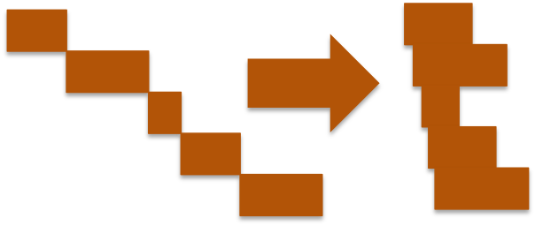

  

    <h2 class="bs-docs-featurette-title">Designed for publishers, by publishers.</h2>
    
Prebid.js is developed with a group of publishers frustrated by weeks-long pre-bid implementations.

    

    

      

        
        <h3>No more engineering work</h3>
        
Prebid.js has built-in integrations with all major bidders: Amazon, AppNexus, Criteo, Pubmatic, Rubicon, etc.

        <a href="" class="btn btn-outline btn-sm">See full bidder list</a>
      

      

        
        <h3>Latency already minimized</h3>
        
All blocking ad calls are now made async. Pre-bid requests now load together with your page's content.

        <a href="" class="btn btn-outline btn-sm">How is this done</a>
      

      

        
        <h3>Maximize revenue</h3>
        
 Prebid.js helps you run a fair auction for all bidders. It rotates bidders and gives them the same amount of time.

        <a href="" class="btn btn-outline btn-sm">Explore more</a>
      

    

    

    
Prebid.js is open source. It's hosted, developed, and maintained on GitHub.

    <a href="getting-started.html" class="btn btn-outline btn-lg">Learn more about Prebid.js</a>
  

