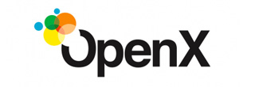

  

    <h2 class="bs-docs-featurette-title">Integrate header bidding partners in minutes, not weeks.</h2>
    
Week-long header bidding implemenations are no picnic. We developed headerbid.js with a group of publishers to relieve that frustration.

    

    

      

        
        <h3>No development required.</h3>
        
headerbid.js has built-in integrations with all major bidders: Amazon, AppNexus, Criteo, Pubmatic, Rubicon, etc.

        <a href="" class="btn btn-outline">See full bidder list</a>
      

      

        
        <h3>500 line items</h3>
        
No more confusing line item and targeting setup. Only 500 line items can now handle all header bidding bidders and sizes.

        <a href="adops.html" class="btn btn-outline">Learn more</a>
      

      

        
        <h3>Reduce page load time.</h3>
        
All blocking ad calls are now made async. Header bidding requests now load together with your page's content.

        <a href="" class="btn btn-outline">How is this done</a>
      

<!--
      

        
        <h3>Maximize revenue.</h3>
        
 headerbid.js helps you run a fair auction for all bidders. It rotates bidders and gives them the same amount of time.

        <a href="" class="btn btn-outline btn-sm">Explore more</a>
      

-->

    

    

    <h2 class="bs-docs-featurette-title">All Major Bidders Supported.</h2>
    
headerbid.js has built-in, most up to date adapters for all of the major header bidding bidders.

    

    
      

        
      

    
      

        
      

    
      

        
      

    
      

        
      

      

        
      

      

        
      

    
    

    

    <h2 class="bs-docs-featurette-title">Open Source and Community Owned.</h2>
    
    
headerbid.js is open source software. Anyone is free to modify the code and contribute adapters for new bidders. headerbid.js is hosted, developed, and maintained on GitHub.

    <a href="getting-started.html" class="btn btn-outline btn-lg">Learn more about headerbid.js</a>

    
  

