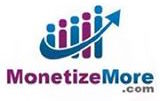
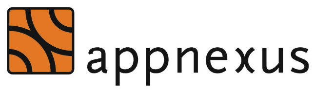

    

      

    

    
The above header bidding ad is auctioned with Prebid.js. <a href="/overview/intro.html" target="_blank">Learn more about this auction here.</a>

  

    <input type="text" class="form-control" id="email-field" placeholder="Email" required>
  

  

    <button class="btn btn-outline btn-lg" id="submit-email" onclick="submitEmail()">Join Best Practices Group</button>
  
        

<!--     <h2 class="bs-docs-featurette-title">Integrate header bidding partners in minutes, not weeks.</h2>
    
Week-long header bidding implemenations are no picnic. We developed Prebid.js with a group of publishers to relieve that frustration.
 
-->

    

    

      

        
        <h3>No development required</h3>
        
Prebid.js includes adaptors for AppNexus, Pubmatic, Rubicon Project, and more.

        <a href="/dev-docs/bidders.html" class="btn btn-outline">See the Full Bidder List</a>
      

      

        
        <h3>Easy line item setup</h3>
        
Ad ops can control the bidders, ad sizes, and price buckets with a single group of line items.

        <a href="adops.html" class="btn btn-outline">Read the Ad Ops Guide</a>
      

      

        
        <h3>Reduce latency</h3>
        
Improve user experience with asynchronous ad calls that load together with the page content.

        <a href="/overview/how-to-reduce-latency-of-header-bidding.html" class="btn btn-outline">Show Me How</a>
      

    

    

    <h2 class="bs-docs-featurette-title">Tags That Work in Prebid.js</h2>
    <!-- 
Prebid.js includes adaptors to the major SSPs, ad networks, and exchanges.
 -->

    

    
    <!-- START BIDDERS -->
    <!-- (Note: Bidders are sorted alphabetically.) -->

    
<h3>Aardvark by RTK</h3>

    
<h3>Adform</h3>

    
<h3>AdMedia</h3>

    
<h3>AOL</h3>

    
<h3>AppNexus</h3>

    
<h3>bRealTime</h3>

    
<h3>Index</h3>

    
<h3>NginAd</h3>

    
<h3>OpenX</h3>

    
<h3>Pubmatic</h3>

    
<h3>PulsePoint</h3>

    
<h3>Rubicon</h3>

    
<h3>Sekindo</h3>

    
<h3>Sonobi</h3>

    
<h3>Sovrn</h3>

    
<h3>SpringServe</h3>

    
<h3>TripleLift</h3>

    
<h3>WideOrbit</h3>

    
<h3>Yieldbot</h3>

    <!-- END BIDDERS -->
    
    

<!-- 
    

    <h2 class="bs-docs-featurette-title">Partners Center</h2>
    
A free an open marketplace for publishers and bidders supporting Prebid.org to connect.

    

    
      

        

          
        

        <a href="mailto:kean@monetizemore.com" class="btn btn-outline">Contact Publisher</a>
      

      

        

          
        

        <a href="mailto:rnovak@sonobi.com" class="btn btn-outline">Contact Bidder</a>
      

    
      

        

          
        

        <a href="mailto:emry@studybreakmedia.com" class="btn btn-outline">Contact Publisher</a>
      

      

        

          
        

        <a href="mailto:mmcneeley@appnexus.com" class="btn btn-outline">Contact Bidder</a>
      

    

      

        

          
        

        <a href="mailto:rnovak@sonobi.com" class="btn btn-outline">Contact Bidder</a>
      

    
      

        

          
Add Your Company!

        

        <a href="/addme.html#contact-companies" class="btn btn-outline">Enter Here</a>
      

    
    

 -->
 
    

    <h2 class="bs-docs-featurette-title">Open Source Project</h2>
    
    
Prebid.js is open source and community driven. The project is hosted, developed, and maintained on GitHub.

    <a href="/overview/intro.html" class="btn btn-outline btn-lg">Next: Overview of Prebid.js</a>

